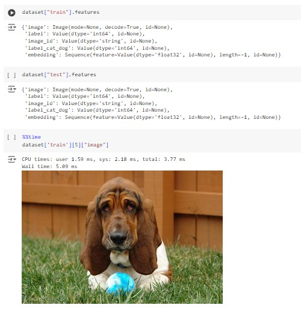
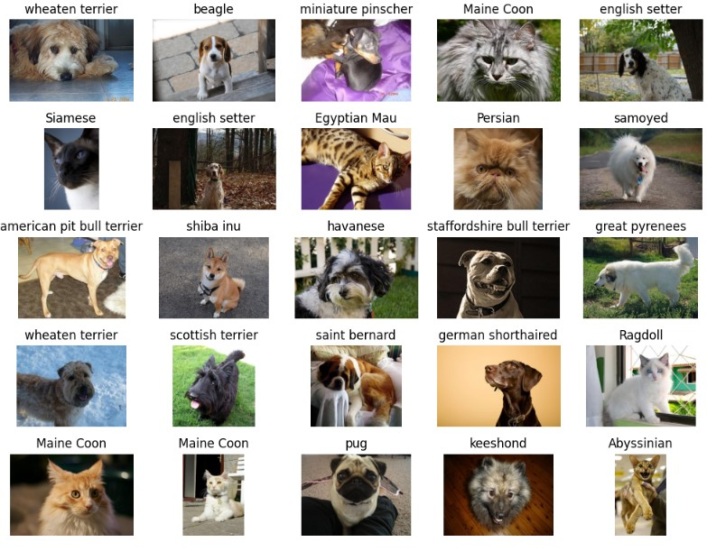
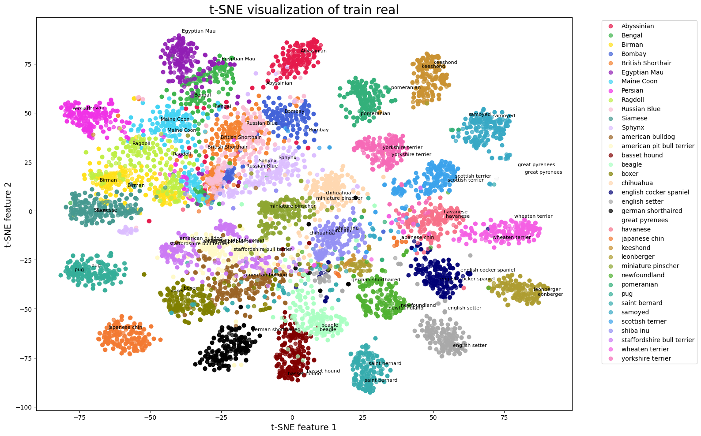

# Proyecto de Clustering con Embeddings

## Descripción

Este proyecto utiliza **embeddings** para mejorar el proceso de clustering en datos de alta dimensión. Los embeddings se utilizan para representar datos complejos en un espacio vectorial más manejable y eficiente. En procesamiento de lenguaje natural(NLP), visión por computadora y sistemas de recomendación, facilitan la comparación, agrupamiento y análisis de datos. También se aplican en clustering, reducción de dimensionalidad y generación de contenidos, mejorando la precisión y comprensión en diversas aplicaciones.

## 1. Obtención de Embeddings

### a. Embeddings de Texto

Para datos textuales, se utilizan las siguientes técnicas:
- **Word2Vec**: Representa palabras en un espacio vectorial donde palabras con significados similares están cerca.
- **GloVe**: Utiliza una matriz de coocurrencia global para representar palabras.
- **BERT**: Modelos avanzados que capturan el contexto y significado de las palabras.

### b. Embeddings de Imágenes

Para datos visuales, se emplean modelos preentrenados como:
- **VGG16/VGG19**
- **ResNet**
- **Inception**

Estos modelos extraen características útiles de las imágenes para el clustering.

### c. Embeddings para Datos Estructurados

Para datos tabulares, se consideran técnicas como:
- **Autoencoders**: Redes neuronales que aprenden a codificar datos en una representación compacta.
- **t-SNE**: Técnica de reducción de dimensionalidad que preserva las distancias locales entre puntos.

## 2. Aplicación de Clustering

Una vez obtenidos los embeddings, se aplican los siguientes algoritmos de clustering:
- **K-Means**: Divide los datos en K clusters, minimizando la distancia intra-cluster.
- **DBSCAN**: Basado en densidad, no requiere especificar el número de clusters.
- **Agglomerative Clustering**: Crea una jerarquía de clusters basada en distancias.

Podemos ver como se obtiene una imagen a partir de un Embedding
 

## 3. Evaluación del Clustering

Para evaluar la calidad del clustering, se utilizan métodos como:
- **Silhouette Score**: Mide cuán similar es un objeto a su propio cluster en comparación con otros clusters.
- **Elbow Method**: Determina el número óptimo de clusters observando la variación intra-cluster en función del número de clusters.

## 4. Visualización

Para interpretar los clusters, se visualizan en un espacio reducido usando:
- **t-SNE**: Técnica que ayuda a visualizar clusters en 2D o 3D preservando las distancias locales.
- **UMAP**: Técnica de reducción de dimensionalidad que proporciona una visualización eficaz de datos en espacios reducidos.

## Uso

